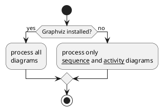

https://zhuanlan.zhihu.com/p/76948461

https://plantuml.com/zh/running

### 活动图
1. 作用：表达业务流程，进行动态的行为建模
2. 基础语法：开始状态、结束状态、活动、判断、合并
3. 判断的三种表示
  
4. 泳道：更好表达活动的发起者
5. 并行活动：加黑的短线分别表示并行活动的分叉和汇合
6. 对象与对象流：可理解为工作的产出物，用于表达活动的输入或输出
7. 活动与动作：动作是不可再细分的活动
   